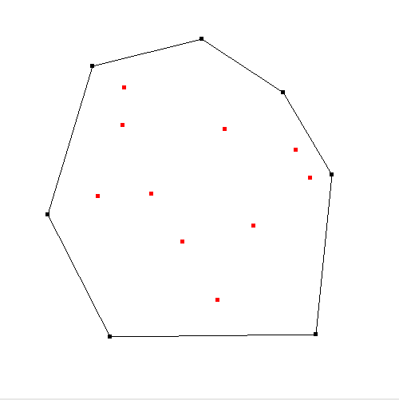

# Lab 4

This lab, I played with algorithms for generating convex hulls.

As in the above image, the algorithm will take an array of points, and return
the shape of the convex hull - the points on the outside.

I implemented 2 algorithms:
- [Gift-Wrapping Algorithm (jarvis Hull)](https://en.wikipedia.org/wiki/Gift_wrapping_algorithm)
- [Graham Scan](https://en.wikipedia.org/wiki/Graham_scan)

## TODO 1

First,I completed the functions given in `point.h`. You will be implementing:

- `dot` - dot product
- `cross` - cross product
- `distanceSquared` - distance squared between two points
- `a.leftTurn(b,c)` - Whether when going from `a` to `c` would give a left turn at `b`

Detailed descriptions of the functions are given in `point.h`.

## TODO 2

Implemented one of the `O(nlogn)` sorting algorithms learned in class. 

- quicksort // Chose to use this one
- mergesort
- heapsort

## TODO 3

In this part of the lab, I implemented the gift-wrapping algorithm, and the graham scan algorithm (in `hull.cpp`). 

